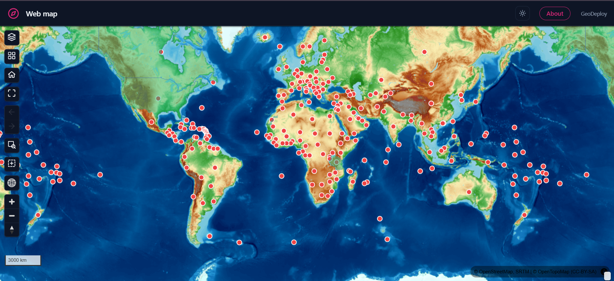
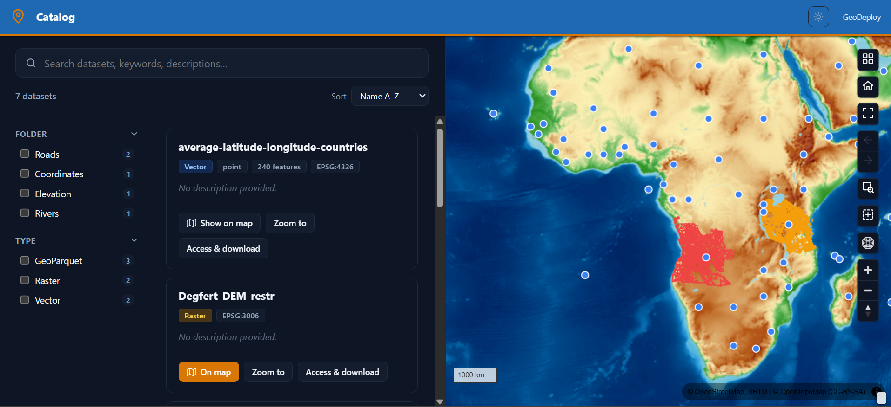
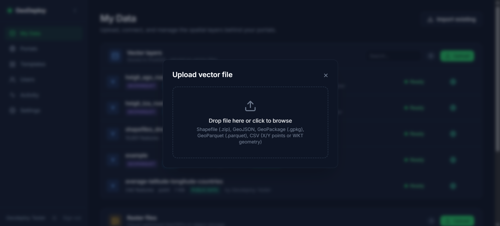
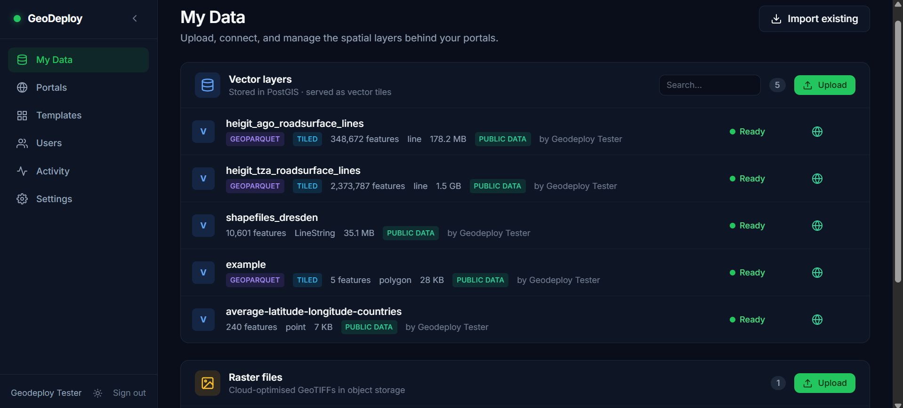
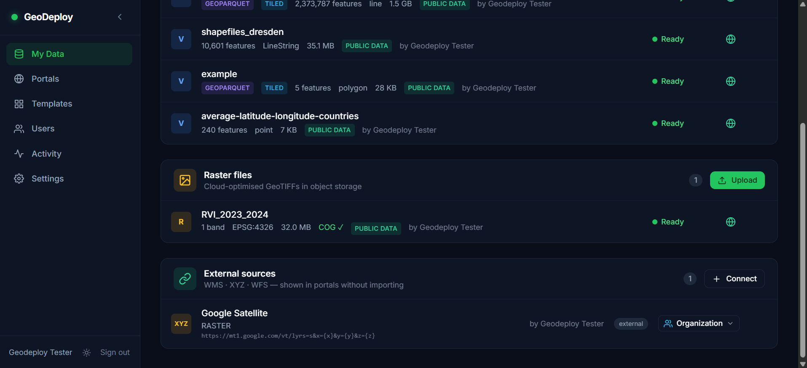
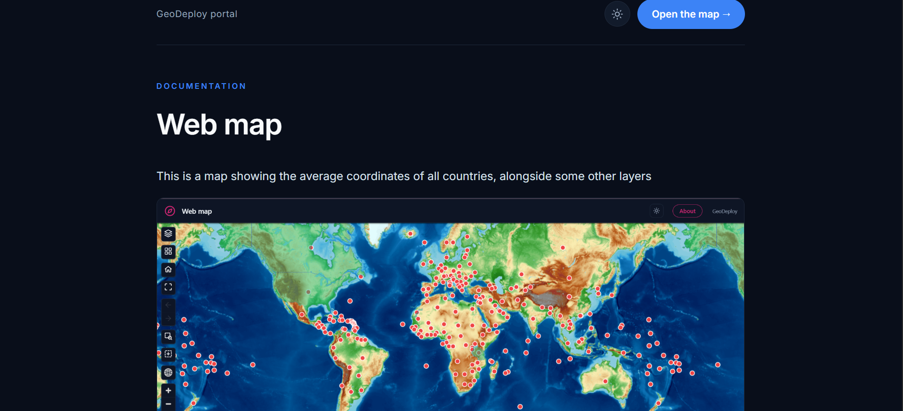
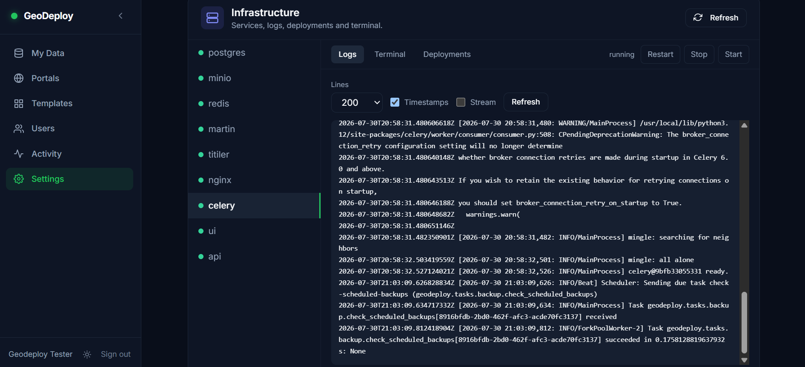
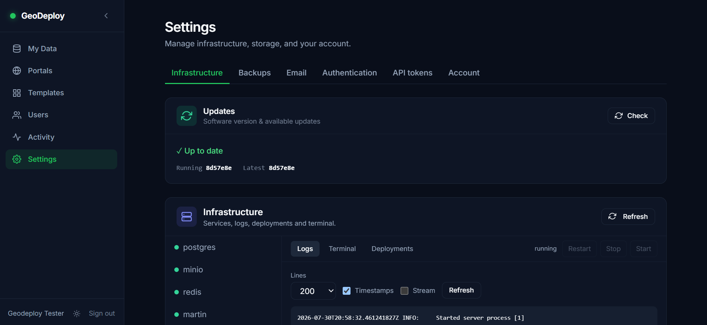
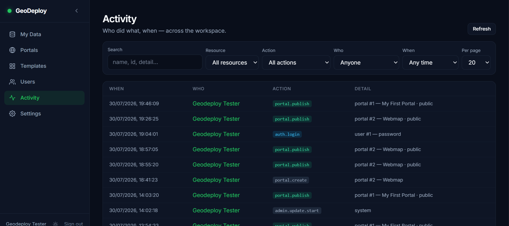
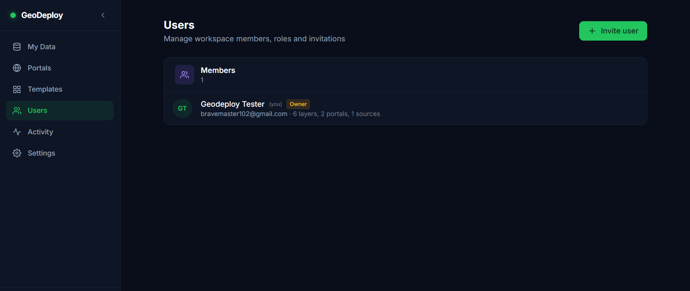

---
hide:
  - navigation
  - toc
---

<div class="gd-hero" markdown>

# Your data. Your server. Your map.

<p class="gd-sub" markdown>
GeoDeploy is a self-hosted spatial data platform and geoportal builder. Upload your data, style it,
and publish a map anyone can use — with your own domain, your own storage, and no per-seat pricing.
</p>

[Get started](getting-started.md){ .md-button .md-button--primary }
[See what it publishes](#three-kinds-of-portal){ .md-button }

<div class="gd-install" markdown>
```bash
curl -fsSL https://raw.githubusercontent.com/bravemaster3/geodeploy/main/installer/install.sh | bash
```
</div>

</div>

<figure class="gd-shot gd-shot-lead" markdown>

<figcaption>A published portal. Your layers, your branding, its own URL — nothing for visitors to install.</figcaption>
</figure>

One command installs the whole stack on a single Linux server: a spatial database, object storage,
vector and raster tile services, a web dashboard, and the portals you publish from it. A setup wizard
handles the rest.

## Three kinds of portal

The experience you choose changes the shape of the page, not just its colours.

<div class="gd-tiles" markdown>

<figure markdown>

<figcaption>**Web map** — map-first, with a layer list beside it. For when the map is the point.</figcaption>
</figure>

<figure markdown>

<figcaption>**Story map** — scrollytelling. Each section is pinned to a camera and a set of layers.</figcaption>
</figure>

<figure markdown>

<figcaption>**Catalog** — search and facets beside the map, for more datasets than one map should hold.</figcaption>
</figure>

</div>

[How portals work](portals.md){ .md-button }

## Get your data in

Shapefile, GeoPackage, GeoJSON, CSV, GeoParquet and GeoTIFF. Large files upload straight to object
storage, so a multi-gigabyte dataset is not a special case.

<div class="gd-tiles gd-tiles-2" markdown>

<figure markdown>

<figcaption>Drag a file in. Validation, reprojection and tiling happen in the background.</figcaption>
</figure>

<figure markdown>

<figcaption>Everything you have, with its status, size and storage backend.</figcaption>
</figure>

</div>

[Uploading data](uploading.md){ .md-button }

## Describe it once, publish it everywhere

Fill in an abstract, keywords and a licence, and that metadata drives portal search, the About page,
and the open standards other tools read.

<div class="gd-tiles gd-tiles-2" markdown>

<figure markdown>

<figcaption>Catalog metadata per layer, and the access links that come with it.</figcaption>
</figure>

<figure markdown>

<figcaption>A documentation page published beside the map.</figcaption>
</figure>

</div>

Shared layers are readable by standard clients over **OGC API - Features**, **STAC**,
**Cloud-Optimized GeoTIFF**, **PMTiles** and **GeoParquet** — so QGIS, Python and R consume them
directly, with no export step.

[Access from other tools](data-access.md){ .md-button }

## Run it without a terminal

Service logs, backups to a separate destination, an in-app restore, and one-button updates.

<div class="gd-tiles" markdown>

<figure markdown>

<figcaption>Every service, its logs, and its state.</figcaption>
</figure>

<figure markdown>

<figcaption>Check for a new version and update in place.</figcaption>
</figure>

<figure markdown>

<figcaption>Who changed what, kept even after an account is removed.</figcaption>
</figure>

</div>

[Updating](updating.md){ .md-button } [Backups and restore](backups.md){ .md-button }

## Work as a team

Roles from viewer to owner, per-layer visibility, invitation links and scoped API tokens.

<figure class="gd-shot" markdown>

<figcaption>Invite by link — no mail server required.</figcaption>
</figure>

[Users, roles and sharing](users-and-sharing.md){ .md-button }

## Runs on a small server

The reference setup is a modest VPS — 2 vCPU, 8 GB RAM, 80 GB disk — which comfortably runs a real
geoportal with real data on it. Everything is Docker Compose behind nginx: one thing to start, one
thing to update.

<div class="gd-next" markdown>

| If you want to… | Read |
| --- | --- |
| Install it and publish something | [Getting started](getting-started.md) |
| Understand the portal types | [Portals and experiences](portals.md) |
| Get your data into QGIS or DuckDB | [Access from other tools](data-access.md) |
| Script against it | [API reference](api-reference.md) |
| Keep it backed up | [Backups and restore](backups.md) |
| Tune it for heavy layers | [Performance tuning](performance-tuning.md) |
| See what is planned | [Roadmap](roadmap.md) |

</div>
