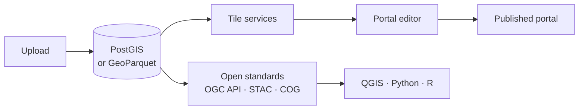

# GeoDeploy

**Self-hosted spatial data platform and geoportal builder.** Upload your data, style it, and publish
a map anyone can use — on your own server, with your own domain, and no per-seat pricing.

One install command gives you a complete stack: a spatial database, object storage, vector and
raster tile services, a web dashboard, and the published portals themselves.

[Get started](getting-started.md){ .md-button .md-button--primary }
[Access your data from QGIS](data-access.md){ .md-button }

---

## What you can do with it

-   :material-upload: **Bring your data in**

    Shapefiles, GeoPackage, GeoJSON, CSV, GeoParquet and GeoTIFF. Large files upload directly to
    storage, so a multi-gigabyte dataset is not a problem.

    [Uploading data](uploading.md)

-   :material-map: **Publish a portal**

    Choose an experience — a web map, a scrollytelling story, or a searchable catalog — arrange
    your layers, and publish. Each portal gets its own URL and access level.

    [Portals and experiences](portals.md)

-   :material-share-variant: **Share data properly**

    Shared layers are readable by standard clients over open standards, so QGIS, Python and R can
    consume them directly — no export step, no format conversion.

    [Access from other tools](data-access.md)

-   :material-account-group: **Work as a team**

    Roles from viewer to owner, per-layer visibility, invitation links, API tokens for scripts, and
    an audit log of who changed what.

    [Users, roles and sharing](users-and-sharing.md)

---

## How it fits together

Vector data lands in **PostGIS** or as **GeoParquet** files, depending on its size and how you want
to use it. Rasters are converted to **Cloud-Optimized GeoTIFF**. Everything is then reachable two
ways: through the portals you publish, and through open standards that other tools already speak.

## What it runs on

A single Linux server. The reference setup is a small VPS — 2 vCPU, 8 GB RAM, 80 GB disk — which is
enough for a working geoportal with real data on it. Everything is Docker Compose behind nginx, so
there is one thing to start and one thing to update.

!!! tip "Updating is a button"
    GeoDeploy checks for new versions and can update itself from the dashboard, including the
    database schema. See [Updating](updating.md).

## Where to go next

| If you want to… | Read |
| --- | --- |
| Install it and publish something | [Getting started](getting-started.md) |
| Understand the portal types | [Portals and experiences](portals.md) |
| Get your data into QGIS or DuckDB | [Access from other tools](data-access.md) |
| Script against it | [API reference](api-reference.md) |
| Set up backups | [Backups and restore](backups.md) |
| See what is planned | [Roadmap](roadmap.md) |
