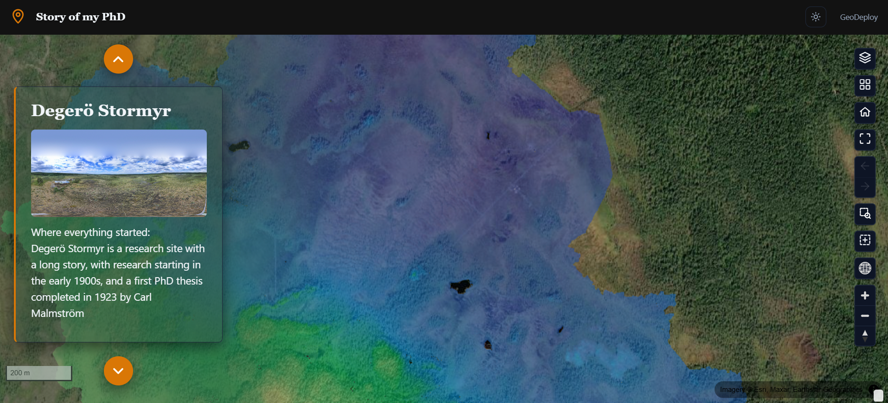

# Story maps

A **story map** is scrollytelling. The page is a column of written sections, each pinned to a map
position and a set of visible layers, and the map animates as the reader scrolls from one to the
next.

Choose it when the material has an order — a route, a chronology, an argument, a before-and-after.
If a reader could start anywhere and lose nothing, a [web map](web-maps.md) is the better fit.

---

## The page

<figure markdown>

<figcaption>A narrative column drives the map camera as the reader scrolls.</figcaption>
</figure>

The narrative column sits over the map. The layer list starts collapsed so the story leads — it is
still there, behind its toggle, for a reader who wants to explore off the path.

---

## Sections

A story is a list of sections, and each one carries four things:

| | |
|---|---|
| **Title** | The heading for this step |
| **Text** | The body copy — what you want read while the map is here |
| **View** | The map camera: centre, zoom, and the pitch and bearing if you tilted it |
| **Layers** | Which layers are visible for this section |

### Building one

1. Open the portal editor with the **Story map** experience selected.
2. **Add section**, and write the title and text.
3. Move the map to where that section should be read — pan, zoom, tilt, rotate — and **capture** the
   view onto the section.
4. Switch the layers you want visible for that step.
5. Repeat, and reorder sections by moving them up or down.

!!! tip "Capture last"
    Write the text first, then position the map and capture. Capturing is a snapshot of wherever the
    map is at that moment, so it is easier to get right once you know what the section is saying.

### What the reader sees

Scrolling from one section to the next flies the camera between the captured views and fades the
layer visibility to match. A reader who scrolls quickly does not queue up a sequence of animations —
the map goes to the section they land on.

---

## Layers in a story

Layer visibility is **per section**, which is most of what makes a story map work: you can introduce
one layer at a time, swap a "before" for an "after", or strip back to the basemap for a wide
establishing shot.

The layers themselves are the portal's layers, styled the same way as anywhere else. A story does
not get its own copies — restyling a layer restyles it in every section.

---

## Layout choices

| Option | What it does |
| --- | --- |
| **Header** | Minimal by default, so the story is the first thing on the page |
| **Layer list** | Floating and collapsed by default; can be docked or switched off entirely |
| **Controls corner** | Which corner the map controls sit in |
| **Narrative styling** | Background, opacity and text colour of the story column, so it reads over the map beneath it |

The About panel is off by default — a story is already a written description of itself.

---

## On phones

The narrative column becomes full-width and the map sits behind it. Sections still drive the camera,
so the story works the same way; there is simply less map visible beside the words.

!!! note "One gesture to know about"
    On a phone, dragging over the map pans the map rather than scrolling the page. Scroll using the
    narrative column.

---

## When to choose something else

- The reader should **browse rather than be led** → [Web maps](web-maps.md)
- You are publishing **many datasets** for people to find → [Catalogs](catalogs.md)
- The point is **numbers that respond to each other** → [Dashboards](dashboards.md)
