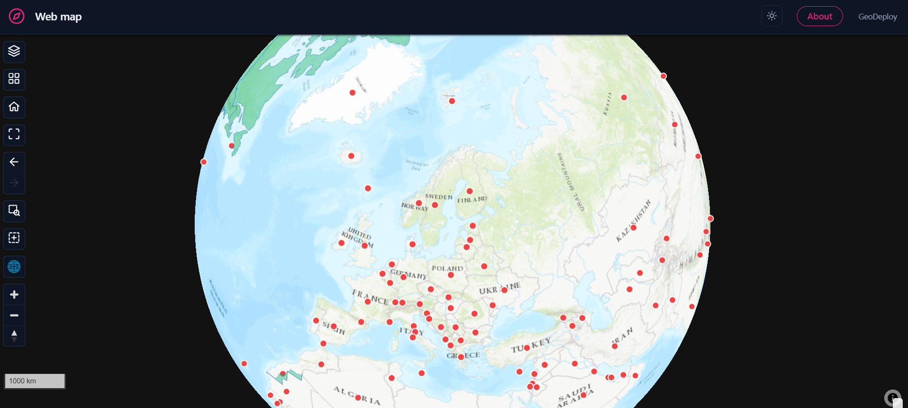

# Web maps

A **web map** is the default experience and the right one when the map itself is the point: a
full-screen map with a layer list beside it, and everything else arranged around that.

If you are not sure which experience you want, start here. Switching later keeps your layers, your
styling and your branding — only the arrangement changes.

---

## The page

<figure markdown>

<figcaption>Map-first, with the layer list docked beside it.</figcaption>
</figure>

**The layer list** is the main furniture. Each layer shows a swatch, its name, an eye to hide it, a
zoom-to-extent button, and — where the symbology has classes — its legend, which expands under the
row. Layers can be dragged to reorder; the top of the list draws on top of the map.

**Folders** group layers, and a folder can be collapsed, hidden as a unit, or zoomed to as a unit.
Useful once a portal carries more than a handful of layers.

**A search box** appears above the list once there are enough layers to be worth filtering.

---

## Layout choices

| Option | What it does |
| --- | --- |
| **Side** | Layer list on the left or the right |
| **Mode** | *Docked* takes a column beside the map; *floating* overlays it, which gives the map the full width |
| **Start collapsed** | Opens with the list closed — one tap on the on-map toggle opens it |
| **Width** | How wide the docked column is |
| **Controls corner** | Which corner the map's control cluster sits in |
| **Header** | A full bar, or a minimal treatment |

Panels can each be switched on or off: the layer list, the legend, the basemap switcher and the
About page.

!!! tip "Floating vs docked"
    A docked list is easier to scan and costs the map a column. A floating one gives the map the
    whole page and asks the visitor to open the list when they want it. For a portal with two or
    three layers, floating and collapsed is usually the better default.

---

## What visitors get on the map

Every published portal — not only a web map — carries:

- **Basemap switcher**, and a **2D/3D globe** toggle
- **Home**, which returns to the view you pinned when publishing, and **zoom to all layers**
- **Previous / next extent** — the navigation history every desktop GIS has, for stepping back after
  a zoom-to
- **Click to identify** — attributes for the feature under the cursor, including layers served from
  files rather than a database
- **Draw a box to download** — see below

### Pinning the starting view

Position the map how you want visitors to arrive, then capture it in the editor. That view is what
**Home** returns to, and what the portal opens on. Pitch and bearing are captured too, so a portal
can open tilted.

### Download by area

A visitor can draw a box and download just that area, choosing a format per layer. The clip runs on
the server and is prepared in the background, so a large selection does not block the page.

---

## About panel

A web map can carry an **About** page — a written description of what the portal is, who made it and
what the data means. It is off in the other experiences by default, because a catalog puts that
information on each dataset card and a dashboard's widgets name their own data.

---

## On phones

The layer list becomes a drawer that starts closed so the map is visible, and the map controls stay
reachable. Nothing is removed.

---

## When to choose something else

- The story is a **narrative** with a beginning and an end → [Story maps](story-maps.md)
- You have **more datasets than one map should show at once** → [Catalogs](catalogs.md)
- The question is about the **data** rather than the geography → [Dashboards](dashboards.md)
